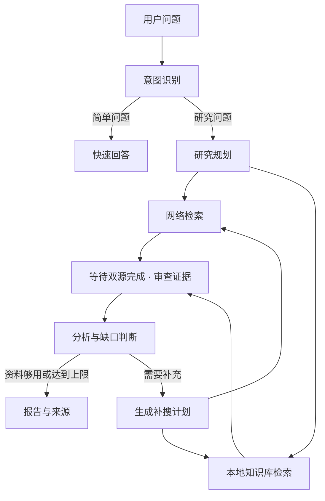

# DeepResearch

DeepResearch 是我设计与开发的个人多智能体研究项目，作者为 [SuperSgdk](https://github.com/SuperSgdk)。我希望把研究问题的拆解、资料检索、证据审查和报告生成串成一个完整流程，减少手动整理多来源资料的工作。

项目后端使用 Python、FastAPI 和 LangGraph，前端使用 Vue 3 与 TypeScript。这个仓库展示我的项目设计、实现代码和验证记录。

## 已实现的功能

- **意图分流**：简单问题快速回答，复杂问题进入研究流程。
- **双源检索**：博查网络搜索与 Milvus 本地知识库并行检索；检索由代码执行，模型负责整理与分析。
- **证据审查**：保留来源编号，检查证据冲突；最终报告附来源链接或本地文档定位。
- **有限补搜**：证据有缺口时生成补搜计划，达到轮数上限后结束。
- **会话记忆**：PostgreSQL 保存对话及工作流检查点，Milvus 支持语义记忆召回。
- **流式进度**：网页展示节点完成事件与最终 Markdown 报告。



## 查看范围

我公开这个仓库，用于展示个人项目成果及其实现方式，**保留所有权利，仅供查看**。未经 SuperSgdk 事先书面授权，不得运行、修改、部署、再分发或将代码用于其他项目，包括商业与非商业用途。

公开仓库在技术上仍可下载或 fork；GitHub 平台条款规定的权利不受本声明影响。此前版本已经授予的许可不能通过本次变更追溯撤销。完整条款见 [LICENSE](LICENSE)。

作者维护与已授权者部署步骤见 [docs/deployment.md](docs/deployment.md)，该文档本身不提供使用授权。

## 项目交互

简单问答：`用两句话解释 RAG 是什么。`

研究问题：`结合本地项目说明与官方资料，对比快速问答和多 Agent 研究流程的适用场景，并附来源。`

网页的“新建会话”会生成新的 Thread ID；同一用户的长期记忆仍可能被召回。项目通过不同的 User ID 区分用户级上下文，API 请求中的用户与会话标识由调用端维护。

| 接口 | 用途 |
| --- | --- |
| `GET /health` | 确认后端服务运行 |
| `GET /api/local-status` | 配置存在性与数据库端口连通提示 |
| `POST /api/v1/research/run` | 等待完整结果 |
| `POST /api/v1/research/stream` | SSE 进度与最终结果 |

## 项目结构

```text
app/
  app_main.py                FastAPI 入口与静态网页托管
  backend/                   API、请求校验、工作流服务
  mult_agents/
    graph.py                 路由、并行检索、补搜循环
    nodes.py                 节点执行、证据与引用处理
    prompts.py               各角色提示词
    tools.py                 博查与本地检索接口
    rag/                     知识库、切片、入库
    memory/                  短期与长期记忆
front/agent_front/           Vue 网页
deploy/                     本地 PostgreSQL / Milvus / 可选 Redis
knowledge/                  项目说明与入库验证资料
tests/                      无密钥、无外部服务的回归检查
scripts/audit_public.py      发布内容检查
```

命令行入口：`python main.py --help`。默认 CLI 与网页复用模型、检索和记忆模块。

## 验证与边界

我使用以下维护检查验证回归行为和构建结果；运行权限限于作者与获得书面授权的人。

```bash
python -m pip install -r requirements-dev.txt -c constraints.txt
python -m unittest discover -s tests -v
python scripts/audit_public.py
cd front/agent_front
npm test
npm run build
```

CI 检查后端回归、Python 包构建、前端类型与构建。回归测试使用测试替身，不调用付费模型或搜索；真实验收记录见 [docs/validation.md](docs/validation.md)。

公开内容只保留技术名称与空白配置模板。真实密钥、私人接口地址、账号配置及运行日志保存在本地忽略文件中；发布检查同时扫描当前文件和提交历史，不打印敏感值。规则扫描不能替代人工审查。

- 我目前将项目运行范围限定为本机个人研究，尚未实现登录鉴权、配额、限流或后台任务队列。User/Tenant ID 是上下文标识，不能代替访问控制。
- 来源编号检查不等于事实正确；搜索片段可能过时或不完整，重要结论应核对原文。
- SSE 展示节点完成事件，不是逐字模型输出。浏览器断连暂不会取消后台研究。
- 外部记忆连接失败时可能退回内存；`/health` 与端口可达不能证明模型、检索及记忆全部可用。
- 仓库中的知识资料仅包含项目说明，用于入库与检索验证，不构成行业知识库。资料使用须有合法授权；查询和资料片段会发送到所配置的模型/搜索服务。

## 许可证

项目代码采用 [仅供查看的权利声明](LICENSE)，不是开源使用许可。第三方库和 Docker 镜像沿用各自许可证。
